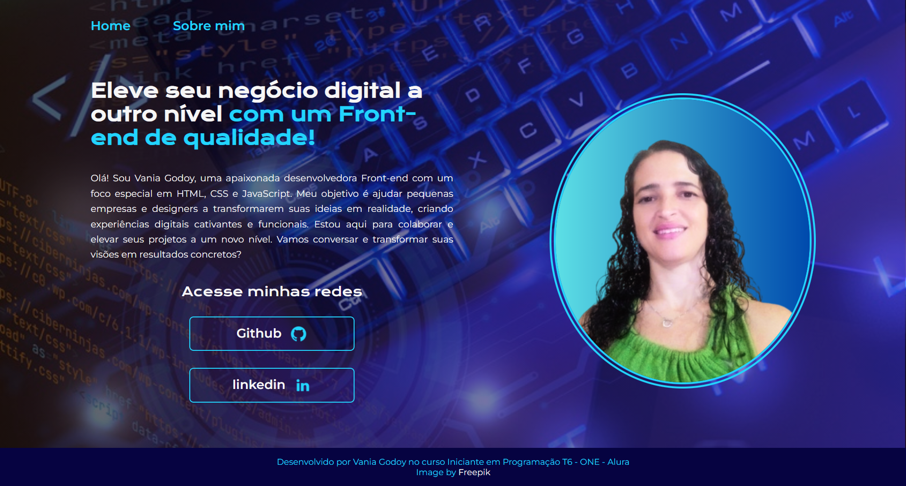

  

<h1 align="center">Meu Portfolio</h1>

  Este é o projeto desenvolvido durante o curso "Iniciante em Programação T6 - ONE" da Alura. Durante o curso, aprendemos a criar e estruturar uma página em HTML, estilizá-la com CSS e torná-la responsiva utilizando media queries. Além disso, exploramos o processo de hospedagem do projeto no GitHub e sua implantação no Vercel para compartilhar com amigos e colegas nosso progresso.

<h3 align="center">Tecnologias Utilizadas</h3>

  
  

